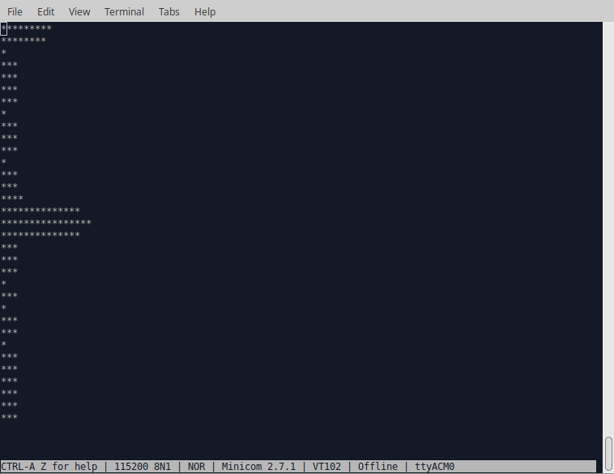

# FFTA - Fastest(?) Fourier Transform for Arduino

# Introduction
This project is about a fast C implementation of the Discrete Fourier Transform[1],[2] for Arduino. The provided DFT/FFT routines are computing the spectra from *real* input data, for example, data that comes from the (10-bit) ADC. The runtime measured for an 8-point DFT with ADC data is 844μs and for an 8-point FFT xxxμs.

With the 8-points data set example: *x=[0, 1, 0, 0, 0, 0, 0, 0]*, MATLAB's fft(x) returns:

*1.0000+0.0000i, 0.7071-0.7071i, 0.0000-1.0000i, -0.7071-0.7071i, -1.0000+0.0000i, -0.7071+0.7071i, 0.0000+1.0000i, 0.7071+0.7071i*

The output from example *dft5.ino* looks very similar:

*1.00  0.00i, 0.71  -0.71i, 0.00  -1.00i, -0.71  -0.71i, -1.00  0.00i, -0.71  0.71i, 0.00  1.00i, 0.71  0.71i*

In FFTA, the trigonometric functions are replaced by a Direct Digital Synthesis (DDS-)algorithm instead of using a look-up table[5], which is rather fast implementation on a micro-controller. The advantage of the DDS algorithm is the fixed length look-up table for different size FFTs. Sketch *dft2*, with the 32-bit DDS-phase accumulator, has the highest phase resolution and is most accurate when transforming larger input vectors. There is no internal overflow check on numbers. The recommended input data types for each example, are given in the table below under *Sketches*.

The DFT-core implemented in the C-language looks like:

# Sketches
Study Sketches | Remarks 
------ | -------
dft1.ino | DFT - floating point implementation using sin() and cos() functions. Input data type: *double* or *int* for real part only.
dft2.ino | DFT with 32bit DDS, 10bit Look-up table (LUT). Input data of type *int*, reals only.
dft3.ino | DFT with 16bit DDS, 10bit LUT. Input data of type *int*, reals only.
dft4.ino | DFT with 16bit DDS, 8bit LUT. Input data of type *char*, reals only. 
dft5.ino | DFT with 16bit DDS, 8bit LUT. ReX and ImX accumulators are reduced to *int*-types, with input data type *char*, reals only.
fft.ino | FFT with 16bit DDS, 10bit LUT. Input data type *double* with real+imaginary input.
ffta.ino | FFT with 16bit DDS, 10bit LUT. Input data of type *int*, reals only.
 **Applications** | 
spectrum.ino | Application example of DFT with 32 bit DDS, 10-bit LUT. Input data is from the ADC input A0. Apply AC voltage on 2.5V DC bias. Defaults: 64 points DFT, fs=8ksps with Hanning windowing and log scale. SPECTRUM PLOTTING DOES NOT WORK IN THE ARDUINO MONITOR. Use a VT100 compatible terminal emulator like minicom or PuTTY. 
spectrum2.ino | FFT

Example spectrum output with Udc = 2.5V + Uac = 1V, f_sinewave = 2kHz:

# Benchmarks
The measured runtime in μs of the different DFT variants running on the Arduino UNO are shown in the table below. The times noted in the table are for the full spectrum calculation (positive and negative frequencies). The data set used for bench-marking is: *x = 0, 1, 0, 0, ...*  [4].

Implementation / N-points: | 8 | 16 | 32 | 64
-------------------------- | - | -- | -- | --
dft1 | 16436 | 66056 | 265968 | 1074168
dft2 | 2228 | 7692 | 28368 | 108520
dft3 | 1424 | 4540 | 15848 | 58620 
dft4 | 844 | 2304 | 6922 | 23400
dft5 | 784 | 2096 | 6184 | 20236

# Conclusion
The computing time of the *dft1 to dft5* programs roughly scale with N^2 as was expected. The computing time of the well known FFT algorithm[1] scales with N*log2(N) and is much faster for larger values of N. The accuracy of the DFT variants are practically usable, even with a 16bit DDS/8-bit LUT core.
Using a DDS wave generator in place of using trigonometric functions, is just an idea that I wanted to test because of its compact and elegant implementation form. This idea might be interesting for other applications.

[1]: https://en.wikipedia.org/wiki/Fast_Fourier_transform

[2]: http://www.fftw.org/

[3]: http://www.sccon.ca/sccon/fft/fft3.htm

[4]: https://www.analog.com/en/resources/analog-dialogue/articles/all-about-direct-digital-synthesis.html

