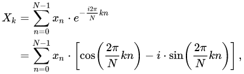
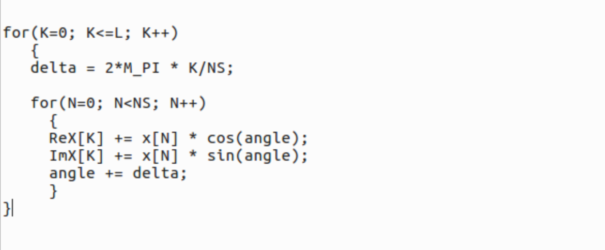
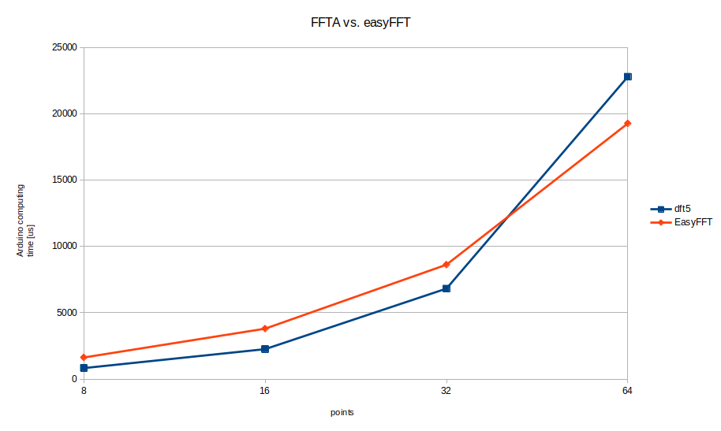

# FFTA - Fastest(?) Fourier Transform for Arduino

# Introduction
This project is about a fast C implementation of the Discrete Fourier Transform[1],[2] for Arduino.
FFTA computes the DFT from *real* input data, for example data that comes from the (10-bit) ADC. The fastest time of an 8-point DFT with FFTA measured is 504μs.

With the 8-points data set example: *x=[0, 1, 0, 0, 0, 0, 0, 0]*, the MATLAB function fft(x) returns:

*1.0000+0.0000i, 0.7071-0.7071i, 0.0000-1.0000i, -0.7071-0.7071i, -1.0000+0.0000i, -0.7071+0.7071i, 0.0000+1.0000i, 0.7071+0.7071i*

the *dft5.ino* sketch returns:

*1.00  0.00i, 0.71  -0.71i, 0.00  -1.00i, -0.71  -0.71i, -1.00  0.00i, -0.71  0.71i, 0.00  1.00i, 0.71  0.71i*

A very clear not mathematical explanation of the FFT is given here:[3]. 
Basically, the DFT formula can be seen as two multipliers and two wave generators stepping in frequency, thereby averaging the outcome of each frequency bin in the frequency spectrum. An electronic device analogy of this process is a two phase/vector-lock-in-amplifier with a sweeped LO (for the one who knows...).

The DFT-core implemented in the C-language looks like:

Herewith FFTA, the trigonometric functions and the angle stepping are replaced by Direct Digital Synthesis wave generators using a look-up table[5], which is super fast on an 8-bit micro-controller. Sketch *dft2* with the 32-bit phase accumulator has a higher frequency step resolution and is because of this more accurate when transforming larger input vectors (to be confirmed).
There is no internal overflow check on numbers. Input data range must be verified. The recommended input data types are given in the table below in paragraph *Sketches*.

# Sketches
Sketch | Purpose
------ | -------
dft1.ino | DFT - floating point implementation using sin() and cos() functions. Input data type: *double* or *int*
dft2.ino | DFT with 32bit DDS, 10bit Look-up table (LUT). Input data is of type *int*
dft3.ino | DFT with 16bit DDS, 10bit LUT. Input data is of type *int*
dft4.ino | DFT with 16bit DDS, 8bit LUT. Input data is of type *char*
dft5.ino | DFT with 16bit DDS, 8bit LUT. ReX and ImX accumulators are reduced to type *int*. Input data is of type *char*
dft6.ino | DFT with 16bit DDS, 8bit LUT, only calculates the positive frequencies. ReX and ImX accumulators are reduced to type *int*. Input data is of type *char*

# Benchmarks
The measured execution times in μs of the different FFT variants running on the Arduino UNO are shown in the table below. The time measured under *dft1 - dft5*, is for the full spectrum calculation (positive and negative frequencies). The data set that was used for bench-marking is: *x = 0, 1, 0, 0, ...*  [4].

Implementation / N-points: | 8 | 16 | 32 | 64
-------------------------- | - | -- | -- | --
dft1 | 16436 | 66056 | 265968 | 1074168
dft2 | 2228 | 7692 | 28368 | 108520
dft3 | 1144 | 3428 | 11440 | 41052
dft4 | 888 | 2484 | 7704 | 26240
dft5 | 824 | 2256 | 6824 | 22816
dft6 | 504 | 1284 | 3644 | 11784
EasyFFT [6] (measured time of FFT function, excluding local variable declarations and Serial.print functions) | 1624 | 3800 | 8628 | 19288

# Conclusion
The computing time of the *dft1 to dft6* programs scale with N^2 as to be expected. The computing time of the well known FFT algorithm[1] scales with N*log2(N) and is much faster for larger N values.
The FFT program for Arduino named EasyFFT by ABHILASH[6], outperforms FFTA for N>32. The accuracy of the FFTA programs is fairly good, even with a 16bit DDS/8-bit LUT.
Using a DDS wave generator in place of the angle stepped sin and cosine functions is just an idea that I wanted to test because of its compact form. The idea might be interesting for other applications.

[1]: https://en.wikipedia.org/wiki/Fast_Fourier_transform

[2]: http://www.fftw.org/

[3]: https://www.earlevel.com/main/2002/08/31/a-gentle-introduction-to-the-fft/

[4]: http://www.sccon.ca/sccon/fft/fft3.htm

[5]: https://github.com/MartinStokroos/NativeDDS

[6]: https://create.arduino.cc/projecthub/abhilashpatel121/easyfft-fast-fourier-transform-fft-for-arduino-9d2677
