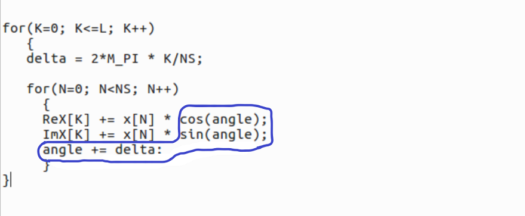

# FFTA - Fastest(?) Fourier Transform for Arduino

# Introduction
This project is about a fast C implementation of the Discrete Fourier Transform[1], [2] for the Arduino. FFTA computes the DFT from *real* input data, for example data coming from the (10-bit) ADC.

On the 8-points data set example: x=[0, 1, 0, 0, 0, 0, 0, 0], the MATLAB function fft(x) returns:

*1.0000+0.0000i   0.7071-0.7071i   0.0000-1.0000i  -0.7071-0.7071i  -1.0000+0.0000i  -0.7071+0.7071i   0.0000+1.0000i   0.7071+0.7071i*

the *dft4* sketch for example returns:

*1.00,	0.00*
*0.71,	-0.71*
*0.00,	-1.00*
*-0.71,	-0.71*
*-1.00,	0.00*
*-0.71,	0.71*
*0.00,	1.00*
*0.71,	0.71*

Basically, the DFT formula is nothing more than two wave generators stepping in frequency and calculating the 'power' in each frequency bin from the frequency spectrum.

The DFT-core implemented in the C-language looks like:

In FFTA the trigonometric functions and the angle stepping are replaced by Direct Digital Synthesis wave generators using a look-up table[4], which is pretty fast on an 8-bit micro-controller.
Sketch *dft2* with the 32-bit phase accumulator has a very high frequency resolution and might be more accurate when transforming large input vectors (to be investigated).

There is no internal overflow check on numbers. The 10-bit range from the ADC is safe to use for input.

# Sketches
Sketch | purpose
------ | -------
dft1.ino | DFT - floating point implementation using sin() and cos() functions
dft2.ino | DFT with 32bit DDS, 10bit Look-up table (LUT)
dft3.ino | DFT with 16bit DDS, 10bit LUT
dft4.ino | DFT with 16bit DDS, 8bit LUT

# Benchmarks
Shown in the table below are the measured execution times in μs of the different FFTA variants on the Arduino UNO for the full spectrum calculation (positive and negative frequencies).
The data set that was used for bench-marking is: x = 0, 1, 0, 0, ...  [3].

N-points: / Implementation: | dft1 | dft2 | dft3 | dft4 | remark
-------------------------- | ---- | ---- | ---- | ---- | ------
8 | 16436 | 1996 | 968 | 720 | input data type: int or double
16 | 66040 | 7552 | 3500 | 2568 | input data type: int
32 | 265880 | 29636 | 13548 | 9812 | input data type: int
64 | 1073796 | 117644 | 53540 | 38600 | input data type: int

### Conclusion
The computing time of *dft1 - dft4* scales with N^2 as expected. The speed ratio of dft1:dft2:dft3:dft4 is about: 26:3:1.5:1.
The FFT algorithm scales with N*log(N) [1]. An integer math implementation of the FFT on the Arduino might be faster than the method proposed here, but this needs to be confirmed.

# Library
The FFTA library, including an example of an audio spectrum analyzer.

- under construction

[1]: https://en.wikipedia.org/wiki/Fast_Fourier_transform

[2]: http://www.fftw.org/

[3]: http://www.sccon.ca/sccon/fft/fft3.htm

[4]: https://github.com/MartinStokroos/NativeDDS
